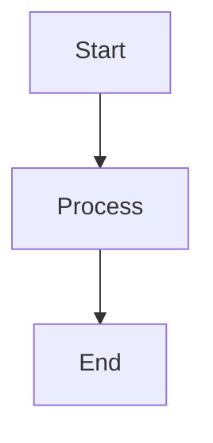

## Overview

Use Mermaid diagrams to add flowcharts, sequence diagrams, and other structured visuals directly in your docs. In Documentation.AI, Mermaid diagrams are rendered from fenced code blocks and automatically gain:

- Interactive zoom controls (in and out, plus reset)
- Fullscreen viewing for complex diagrams
- Automatic light/dark theme support that matches your site
Mermaid is a good fit when you want:

- Repeatable, version-controlled diagrams defined in text
- Architecture or API flows that evolve with your product
- Visual explanations that stay readable across themes and layouts
Diagrams are created using the same code block system as other snippets. For a detailed overview of code blocks, see Code and Groups.

- Diagrams automatically switch between light and dark themes based on your site's theme settings.
## Using with Web Editor

In the Web Editor, Mermaid diagrams are just code blocks with the language set to mermaid.

1. Open or create a page in the Web Editor.
2. Use the slash menu (/) to insert a Code block.
3. In the code block language dropdown, choose mermaid.
4. Paste or write your Mermaid definition inside the block.
- Prefer writing in code?
- You can switch to MDX view inside the Web Editor to write or edit this component using the same syntax as the Code Editor.
For more on inserting and configuring code blocks in the Web Editor, see Code and Groups.

## Using with Code Editor

In the Code Editor (Markdown/MDX), Mermaid diagrams are defined as fenced code blocks with the mermaid language identifier.

### Basic Syntax

You can mix Mermaid blocks with any other Markdown or MDX content, including Code and Groups when you want to show Mermaid alongside other languages.

### Zoom controls

Hover over any diagram to reveal zoom controls in the top-right corner:

- Zoom In - Magnify the diagram up to 300%
- Zoom Out - Reduce the diagram down to 50%
- Reset - Click the percentage to reset to 100%
- Fullscreen - View the diagram in fullscreen mode
- Use fullscreen mode for complex diagrams with many nodes and connections.
## Advanced Options

### Diagram types

Mermaid supports many diagram types, including: flowcharts (process, workflows, decision trees), sequence diagrams (API calls, interactions, message flows), class diagrams (object-oriented structures), state diagrams (application states and transitions), entity relationship diagrams (database schemas), Gantt charts (project timelines), and git graphs (branching strategies).

### Graph directions

Control flowchart layout orientation:

Direction Code Description

Top to Bottom graph TD Vertical flow (default)

Left to Right graph LR Horizontal flow

Bottom to Top graph BT Reverse vertical

Right to Left graph RL Reverse horizontal

### Node shapes

Customize node appearance in flowcharts using rectangle, rounded rectangle, stadium, subroutine, database, circle, asymmetric, diamond, and hexagon shapes.

### Arrow types

Define different connection styles such as solid arrows, open links, dotted arrows, thick arrows, and text-labeled arrows.

### Theme support

Diagrams automatically match your documentation theme:

- Light mode - Uses default Mermaid theme with light backgrounds
- Dark mode - Uses dark Mermaid theme with appropriate colors
- Automatic switching - Updates when theme changes
- No additional configuration needed. Theme switching is automatic and instant.
### Syntax

path language string Required

Use mermaid as the language identifier in fenced code blocks.

path chart string Required

Mermaid diagram definition using valid Mermaid syntax.

path id string

Custom identifier for the diagram. Auto-generated if not provided.

Best practices Keep diagrams readable and accessible:

- Focus each diagram on a single concept or flow
- Prefer 10–15 nodes or fewer per diagram
- Use clear, concise labels for nodes and edges
- Check readability in both light and dark themes
- Add nearby text that explains the diagram for screen readers
- Use the Mermaid Live Editor at mermaid.live to prototype and validate your diagrams before adding them to your documentation.
